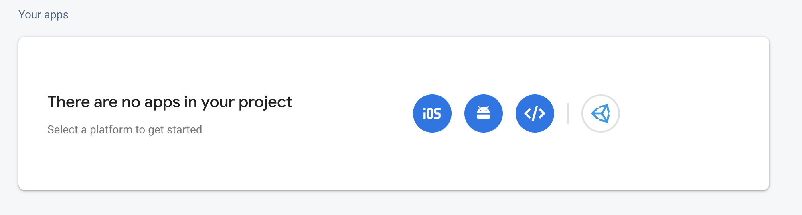
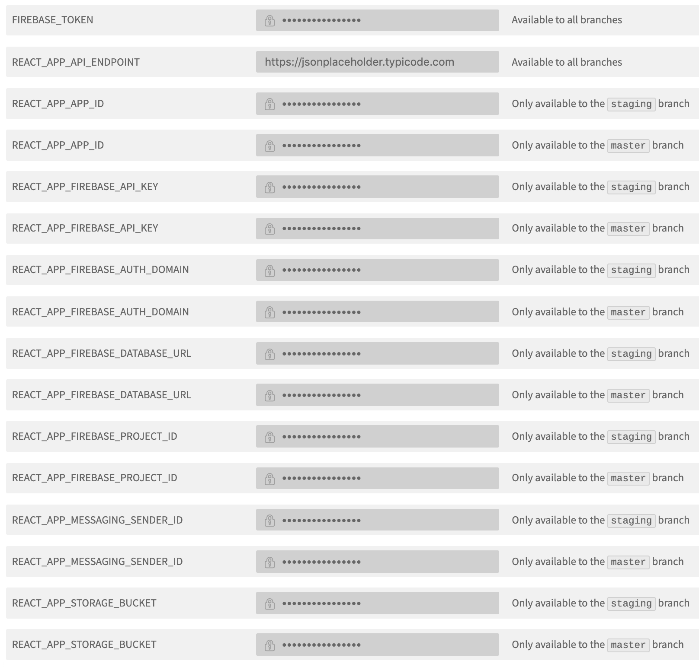

# React-Redux-Firebase-Auth-Firestore

This project was bootstrapped with [Create React App](https://github.com/facebook/create-react-app).

This create react app is a boilerplate that aims to speed up your development process when using the **Google Firebase** tools.
This React App is set to work out of the box with minimum setup:

- You can communicate with either a protected REST API (could be a functions serving an express app for example) or a **Cloud Firestore** database.
- It comes with **Firebase Authentication** and **React-Router** protected routes out of the box.
- You could either deploy this project to Firebase Hosting using the Firebase CLI or modify the included .travis.yml file for continuous deployment.
- The .travis.yml file is set to conditionaly deploy to a staging or production project on Firebase depending on the modified branch on GitHub.

This repo will leverage Travis-CI continous deployment by pushing the production branch to a firebase production project of your choice and the staging branch to another staging project.

---

## STEP 0 - Clone the Repo

No Explanations here, simple.

---

## STEP 1 - Prepare Firebase

### a) Create 2 Firebase projects

Because, like pros, we'll have a staging and a production environment that .travis.yml will deploy to depending on the branch, we need 2 Firebase Projects:

- staging branch = staging project --> ex: `project1-staging`
- master branch = production project --> ex: `project1-production`

In Authentication enable Google as a sign-in method.
In Database create a Cloud Firestore db in locked mode.
Once created edit the rules by replacing the default snippet by this one:

```javascript
rules_version = '2';
service cloud.firestore {
  match /databases/{database}/documents {
    match /{document=**} {
      allow read, write: if request.auth.uid != null;
    }
  }
}
```

> **Note**: Because Firebase Hosting offers the ability to host multiple sites under the same project, we could technically host these 2 deployments under the same roof. Unfortunately Travis-CI doesn't let us deploy to a specific site in a project. Hence the 2 projects. (if you have a solution please hit me up.)

### b) Add the App to your Project

In each of your project settings click on the web icon to get the projects information we'll use as environment variables in the next step.



> **Note**: if you want to host your front end app in one project and access the db/auth/storage... from another project make sure to get those service accounts instead.

---

## STEP 2 - Set Environment Variables

> **Note**: if you have no intention to ever deploy this app and only want to use it on your local machine, meaning you'll only use the `yarn start` script, you only need to create one file : .env

### a) Create 2 files at the base of the app (same level as ./src/)

- `.env` (used on `yarn start`, meaning only on your local machine)
- `.env.local` (used on `yarn build`, this file is optional in case you want to build the app locally and serve the built version or point some environment variables to another project)

> **Note**: Because these files contain sensitive information, they are to never be commited to GitHub.
> Instead we'll set the same environment variables on Travis-CI to get picked up and used during the build process(See below).
> To read more about the 2 files we created up above [Custom Env Variables](https://create-react-app.dev/docs/adding-custom-environment-variables)

### b) Insert the service accounts information in the corresponding files

Example with .env.local:

```javascript
REACT_APP_FIREBASE_API_KEY = 'XXX-XXX';
REACT_APP_FIREBASE_AUTH_DOMAIN = 'project1-staging.firebaseapp.com';
REACT_APP_FIREBASE_DATABASE_URL = 'https://project1-staging.firebaseio.com';
REACT_APP_FIREBASE_PROJECT_ID = 'project1-staging';
REACT_APP_STORAGE_BUCKET = 'project1-staging.appspot.com';
REACT_APP_MESSAGING_SENDER_ID = 'XXXXXXXXXXXX';
REACT_APP_APP_ID = 'X:XXXXXXXXXXX:web:XXXXxxxXXXXXXXXxxxxx';
REACT_APP_API_ENDPOINT = 'https://base-url-of-your-api/'; //optional
```

> **Note**: for create-react-app to pick up the environment variables they need to be prefixed with`REACT_APP_`.

At this point you can make sure your app starts properly:

```sh
$ yarn install
$ yarn start
```

---

## STEP 3 - Prepare for deployment (optional)

If you want to use continuous deployment with [https://travis-ci.com/](travis-ci)

### a) Link Travis-CI and the cloned repository on GitHub

- Go to your Travis-CI [settings](https://travis-ci.com/account/repositories) to connect your new cloned repo and Travis-CI.
- Click on `Manage repositories on GitHub` (if you installed the travis extension beforehand)
- In `Repository access`, add the new cloned repo.

### b) Get a Firebase Token

You can generate a Firebase token. after installing the Firebase tools by running:

```sh
firebase login:ci
```

Save it, we're going to need it in the next step.

### c) Create environment variables on Travis-CI

- Navigate to the repo settings and start adding the environment variables using the same variable names as in the `.env.local` file
- Make sure to create the variables for both the staging and production branch.
- Don't forget to add the variable `FIREBASE_TOKEN` generated in the previous step.



### c) Update the .travis.yml file

You need to make sure that each branch deploys to the right project

- branch staging --> `project1-staging`
- branch master --> `project1-production`

In .travis.yml, in the deploy section, replace both lines that start with `project:` with your `project1-staging` and `project1-production`

```javascript
...
project: project1-production
    on:
      branch: master
...

project: project1-staging
    on:
      branch: staging
```

### d) Push your changes to GitHub

Now that your pipeline is set up, any push to your master or staging branch will trigger a deployment to the corresponding Firebase project.
